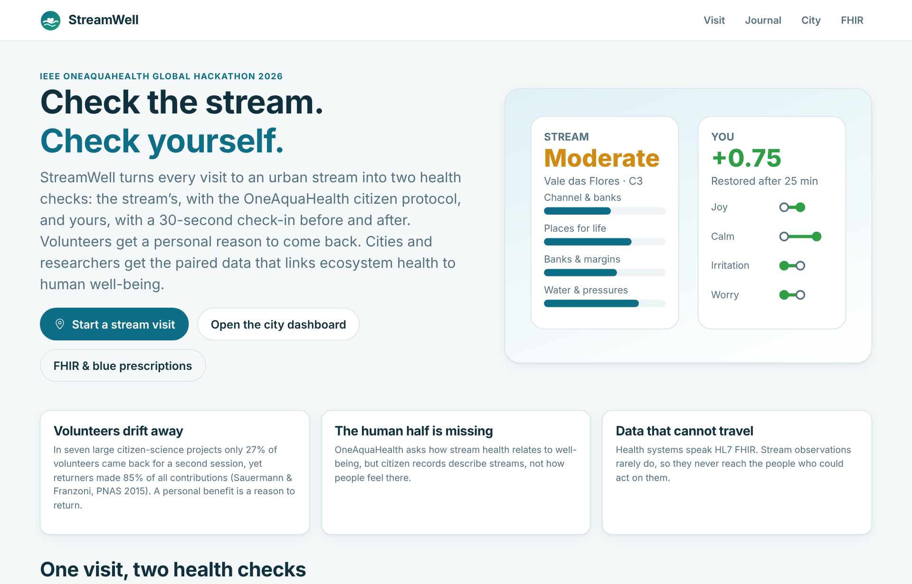
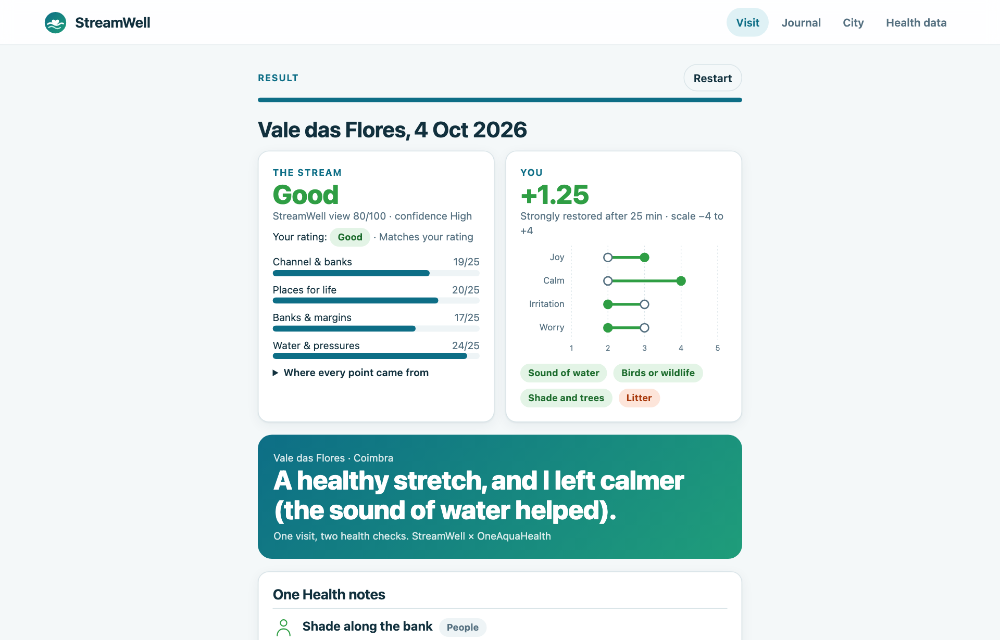
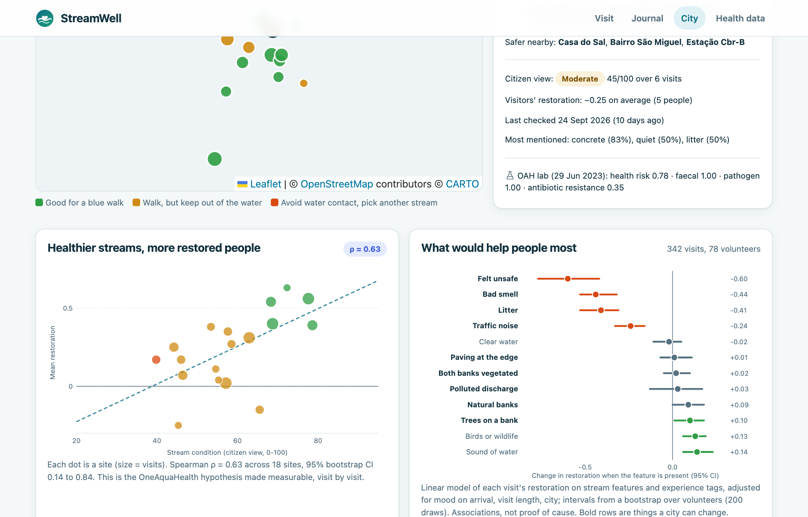
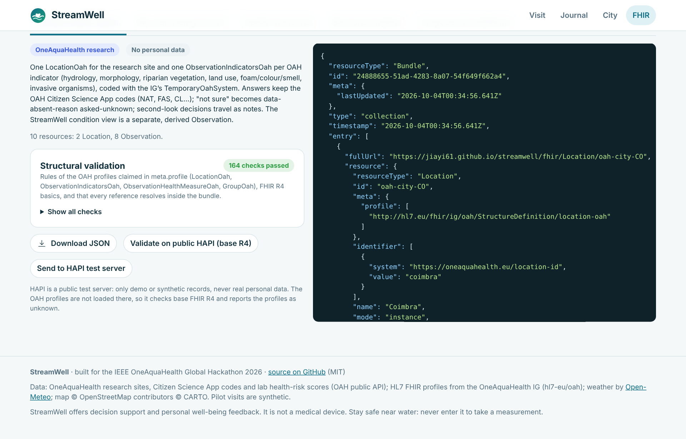
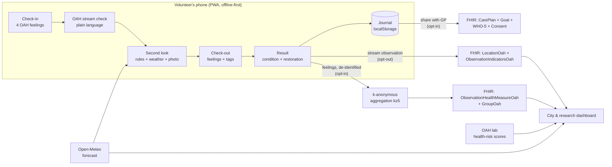

# StreamWell: check the stream, check yourself

**StreamWell turns every visit to an urban stream into two health checks: the stream's, with the OneAquaHealth citizen protocol, and yours, with a 30-second check-in before and after.** Volunteers get a personal reason to come back. Cities and researchers get the paired data that links ecosystem health to human well-being, in HL7 FHIR on the OneAquaHealth Implementation Guide.

Built for the **IEEE OneAquaHealth Global Hackathon 2026**.

- **Live app:** https://jiayi61.github.io/streamwell/
- **Demo video:** _link added at submission_
- **Run locally:** `python3 -m http.server 8000` and open http://localhost:8000 (no build step, no dependencies)

| | |
|---|---|
|  |  |
|  |  |

---

## The problem

OneAquaHealth asks whether healthy urban streams make healthier people. Three gaps stand between that question and an answer:

1. **Volunteers drift away.** Across seven large citizen-science projects, on average only 27% of volunteers came back for a second session, yet returning volunteers produced 85% of all contributions ([Sauermann & Franzoni, PNAS 2015](https://doi.org/10.1073/pnas.1408907112)). The hackathon's Community track names the same problem: low repeat engagement.
2. **The human half is missing.** The OAH health protocol lists well-being, mental health, physical activity and restorative experience as outcomes ([Anastasaki et al.](https://ami.info.umfcluj.ro/index.php/AMI/article/view/1100)), but a citizen record describes the stream, not how the stream made the person feel.
3. **Data that cannot travel.** Health systems speak HL7 FHIR. Stream observations rarely do, so they never reach the people who could act on them.

## The idea: one visit, two health checks

| Step | What happens | Time |
|---|---|---|
| **1. Check in** | Before looking closely, rate four feelings (joy, calm, irritation, worry). These are the four items the OAH Citizen Science App already records, so nothing new is invented. | 30 s |
| **2. Check the stream** | The OAH citizen protocol, field by field and with the app's own answer codes, rewritten in plain words with pictograms, the scientific term underneath, and an honest "not sure". Optional photo. | ~4 min |
| **3. Second look** | Explainable checks compare the answers with each other, with the last 72 h of weather (Open-Meteo) and with an on-device colour reading of the photo. Each flag says what it noticed, why it matters, which answers it used and where the outside data came from. **The volunteer decides**, and the decision is kept with the record. | ~30 s |
| **4. Check out** | The same four feelings again, plus what shaped them (sound of water, litter, felt unsafe...). | 30 s |
| **Result** | The stream's condition and the volunteer's restoration side by side, One Health notes (ecosystem, animals, people), what would help this stretch, and a choice of what to share. | |

Asking the same questions twice turns a feeling into a **change score for the visit**: each person is compared with themselves, which removes most of the "happy people rate everything higher" bias.

## What each audience gets

**Volunteers (journal).** Which streams restore *you* most, with intervals that say when a pattern is not clear yet; weekly streaks; streams you have adopted; missions to streams nobody has checked for 30 days. The reward is personal insight, not points.

**Cities and researchers (dashboard).**
- Every OAH research site on a map, coloured by today's **safe-blue-walk advisory**, the citizens' condition view, or the **real OAH lab health-risk score** (pathogen, faecal, antibiotic-resistance genes).
- **Healthier streams, more restored people:** the OneAquaHealth hypothesis made measurable (site-level Spearman ρ with a bootstrap CI).
- **What would help people most:** a model of each visit's restoration on stream features and experience tags, adjusted for mood on arrival, visit length and city, with intervals from a bootstrap over volunteers. In the pilot data, feeling unsafe, bad smells and litter cost the most; the sound of water, wildlife and natural, tree-lined banks add the most. Each bar is translated into an action (light the path, trace the smell, clean up, plant trees).
- **Where the lab and citizens disagree:** sites that look fine but carry a high lab risk (put up signs, re-sample) and sites that look bad but were never sampled (send the next lab visit there).
- **Early warning with what-if scenarios:** live Open-Meteo forecasts for the five OAH cities, combined with lab faecal scores and recent citizen reports. A storm or heatwave scenario shows which streams to avoid and the nearest safer alternatives, even on a calm day.
- **Health measures for OAH:** monthly site averages of donated well-being data, suppressed below five visitors (k-anonymity), exportable as `ObservationHealthMeasureOah`.

**Health systems (FHIR).** A **blue prescription**: a GP prescribes regular stream walks (nature-based social prescribing), StreamWell steers the patient to streams with a "Go" advisory, records each walk with the same check-in, and returns a FHIR `CarePlan` with WHO-5 outcomes, only if the patient shares it.

## Hackathon tracks

StreamWell is one product, but it answers a problem in every track:

| Track | StreamWell |
|---|---|
| Citizen Science UX | Plain-language OAH protocol, pictograms, scientific term under each question, "not sure", one screen per topic, offline PWA, phone-first |
| Data-to-Insight | Map, site condition, One Health link, drivers model, lab vs citizen disagreement, k-anonymous health measures |
| AI-Supported Assessment | Explainable second look (rules + weather + on-device photo check), human always decides, decisions kept with the record |
| Awareness & Storytelling | Story card per visit, One Health notes for ecosystem / animals / people, personal "what restores you" |
| Community & Gamification | Intrinsic reward (your own restoration), streaks, adopted streams, data-gap missions |
| Resilience Informatics | Safe-blue-walk advisories from forecast + lab + citizen signals, storm and heatwave scenarios, safer alternatives |
| Digital Health Standards | FHIR R4 on the OAH IG (LocationOah, ObservationIndicatorsOah, ObservationHealthMeasureOah, GroupOah), Questionnaire/QuestionnaireResponse, CarePlan, Consent, live HAPI validation, proposed IG additions |

## Real data vs simulated data

| Real | Simulated |
|---|---|
| **106 OAH research sites** (Coimbra 20, Toulouse 24, Ghent 22, Benevento 20, Oslo 20) from the OAH public API `GET /api/sites/all` | **1,664 pilot visits by 261 volunteers** from a seeded, documented model ([`scripts/simulate.py`](scripts/simulate.py)) |
| **OAH Citizen Science App** questions (`CitizenSubmissionPutDTO`) and answer codes (`/api/citizens/*` lookups) | The demo journal (14 visits) and the demo blue prescription (fictional GP) |
| **OAH lab health-risk scores** for 96 sites from `GET /api/resilience-map/health-risks` | |
| **FHIR profiles** from the OneAquaHealth IG ([hl7-eu/oah](https://github.com/hl7-eu/oah)) | |
| **Live weather** from [Open-Meteo](https://open-meteo.com/) | |

Why simulate? No dataset pairs citizen stream assessments with before/after well-being for the same visit. **Producing that dataset is what StreamWell is for.** The simulation's assumptions (blue-space visits improve mood on average, litter lowers restorativeness, people differ in sensitivity, worse arrival mood leaves more room to improve) are written next to the code, with references. Every screen that uses simulated data says so.

## How it works



Plain ES modules, no framework and no build step, so anyone can read the code and the app works from any static host. Leaflet 1.9.4 is vendored (BSD-2-Clause).

| File | Role |
|---|---|
| [`src/protocol.js`](src/protocol.js) | OAH Citizen Science App questions and answer codes, plain-language labels, conversion back to the app's submission format |
| [`src/score.js`](src/score.js) | Condition view (transparent points on the OAH three-class scale), One Health notes, suggested actions |
| [`src/checks.js`](src/checks.js) | Second-look rules; each returns what, why, which answers and the data source |
| [`src/wellbeing.js`](src/wellbeing.js) | Feelings scale, restoration score, experience tags, WHO-5 |
| [`src/photo.js`](src/photo.js) | On-device photo colour check (explains itself; the photo never leaves the phone) |
| [`src/insights.js`](src/insights.js) | Personal insights, site aggregates, drivers model, lab vs citizen, k-anonymous health measures |
| [`src/stats.js`](src/stats.js) | Spearman, bootstrap, OLS with a cluster bootstrap over volunteers |
| [`src/earlywarning.js`](src/earlywarning.js) | Open-Meteo, advisory rules, storm / heatwave scenarios, safer alternatives |
| [`src/fhir.js`](src/fhir.js) · [`src/validate.js`](src/validate.js) | FHIR bundles on the OAH IG; structural validation against the profiles |
| [`src/sites.js`](src/sites.js) · [`src/health-risks.js`](src/health-risks.js) | Real OAH sites and lab health-risk scores |
| [`fhir/`](fhir/) | Generated CodeSystems, Questionnaires and example bundles |
| [`scripts/`](scripts/) | Simulation, research analysis (fixed effects, power), FHIR build, headless smoke test |

More detail: [docs/methods.md](docs/methods.md) (every rule, score and model) and [docs/architecture.md](docs/architecture.md).

## FHIR and One Digital Health

Every visit produces records at **two privacy levels**:

| Bundle | Audience | Privacy | Resources |
|---|---|---|---|
| Stream observation | OneAquaHealth research | No personal data | `LocationOah`, one `ObservationIndicatorsOah` per OAH indicator (hydrology, morphology, riparian vegetation, land use, foam/colour/smell, invasive organisms) coded with the IG's `TemporaryOahSystem`; answers keep the app's codes; "not sure" becomes `data-absent-reason#asked-unknown`; second-look decisions travel as notes |
| Personal well-being record | The volunteer (and their GP if they choose) | Personal health data, stays on the phone | pseudonymous `Patient`, `Questionnaire` + `QuestionnaireResponse`, restoration `Observation` linked to the stream with the core `event-location` extension |
| Health measures | OAH research, public health | Aggregated, k ≥ 5 visitors | `ObservationHealthMeasureOah` with a `GroupOah` cohort (adults, LOINC 30525-0) per site and month; masked cells use `data-absent-reason#masked` |
| Blue prescription | GP and patient | Shared by the patient | `CarePlan`, `Goal` (+10 WHO-5 points), WHO-5 `QuestionnaireResponse`s, visit outcomes, opt-in `Consent` |

All example bundles pass StreamWell's structural validation against the OAH profiles (cardinalities, fixed values, allowed types, reference targets, references resolving inside the bundle), and the app can send any bundle to the public HAPI FHIR server for base-R4 validation. Building on the IG surfaced four small gaps, written up as FSH in [docs/ig-proposal.fsh](docs/ig-proposal.fsh): restorative-experience and physical-activity codes for `HealthIndicatorsOahVs`, a published CodeSystem for the app's answer codes, a "visited location" cohort characteristic, and a citizen-science category with a Questionnaire for the app form.

## Privacy and responsible AI

- **Two privacy levels by design.** Stream observations carry no personal data. Feelings are health data under GDPR (Art. 9), so they stay on the phone unless the volunteer explicitly opts in, and research only ever sees site averages over at least five different visitors.
- **No account, no tracking.** Phone location is only used on the phone to find the nearest site; exports contain the site, never raw GPS. Photos are analysed on the device; only a SHA-256 fingerprint is kept.
- **The human decides.** The second look explains and suggests; it never changes an answer. Every flag shows its reasoning, inputs and data source.
- **Honest uncertainty.** "Not sure" is never counted as good or bad; confidence drops instead. Personal patterns show intervals and say "not clear yet" when they cross zero. The dashboard labels its model as associational.
- **Not a medical device.** WHO-5 is used for programme follow-up with a GP, not for diagnosis.

## Feasibility and scale

- **Works with what OAH already has.** Same questions and codes as the OAH Citizen Science App, same four feelings, same research sites, same FHIR IG. StreamWell can ship as a module of the existing app (the check-in and second look add about one minute) or run beside it, exporting the app's own submission format.
- **Cheap to run.** A static site: no servers, no API keys, works offline after the first visit. Weather from Open-Meteo is free.
- **A pilot that answers the question.** By simulation ([`scripts/analysis.py`](scripts/analysis.py)), about 240 paired visits (40 volunteers × 6 visits) detect a 0.25-point effect of a stream feature present on 20% of visits with 84% power; 360 visits give 96%. That is one summer in one OAH city.
- **Scales across cities and languages.** Sites, cities and questions are data. Translations of the short texts are the main per-city cost.
- **Next steps:** pilot with an OAH city partner; GDPR data-protection impact assessment; translations (PT, FR, IT, NL, NO); propose the IG additions to HL7 Europe; replace the simulated effect sizes with real estimates.

## Run, test, rebuild

```bash
python3 -m http.server 8000      # serve the app at http://localhost:8000
node --test tests/*.test.mjs     # 26 unit tests: protocol, scoring, checks, statistics, early warning, FHIR
node scripts/smoke.mjs           # headless browser walk-through of every view (needs Playwright)
python3 scripts/simulate.py      # regenerate the synthetic pilot data (numpy)
python3 scripts/analysis.py      # fixed-effects model, site-level correlation, pilot power
node scripts/build-fhir.mjs      # regenerate fhir/ (CodeSystems, Questionnaires, example bundles)
```

## Limitations

- The condition view is decision support on the OAH three-class scale, not a validated ecological index.
- All pilot visits and feelings are simulated; effect sizes are illustrative until real data replaces them.
- Weather comes from a model grid, not a gauge at the stream. Lab health-risk scores are from single 2023-2024 sampling campaigns.
- The four feelings are a short state measure; a validated restoration scale could replace them once OAH agrees on one.
- The photo check is a colour heuristic; shade, reflections and plants in frame can mislead it, which is why it only prompts a second look.

## Credits

Data: OneAquaHealth project (Horizon Europe grant 101086521) public API; OneAquaHealth FHIR IG by HL7 Europe and partners; weather by Open-Meteo (CC BY 4.0); map data © OpenStreetMap contributors, tiles © CARTO; Leaflet (BSD-2-Clause). WHO-5 Well-Being Index © Psychiatric Research Unit, Mental Health Centre North Zealand (free to use). StreamWell is an independent hackathon project and is not affiliated with or endorsed by the OneAquaHealth consortium.

Made by Jiayi Liu (Columbia University). Code under the [MIT License](LICENSE).
