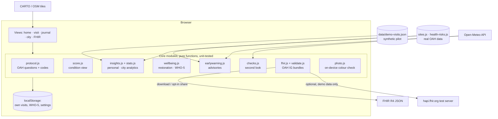

# Architecture

StreamWell is a static, offline-first web app (PWA). There is no server: every computation runs in the browser, personal data stays in `localStorage`, and only explicit exports leave the device. This keeps it cheap to host (any static host, here GitHub Pages), easy to audit, and compatible with GDPR data minimisation.

## Design choices

| Choice | Why |
|---|---|
| Plain ES modules, no framework, no build | Anyone (judges, OAH developers) can read and run it; nothing to install; works on any static host |
| Pure functions in `src/*.js`, DOM only in `view-*.js` | Logic is testable in Node (`node --test`) and reusable in the OAH app |
| Bundled OAH sites and lab scores | The OAH API refuses cross-site browser requests, so data is snapshotted with the retrieval date |
| Leaflet vendored | No CDN dependency; the app shell works offline |
| Network-first service worker for app files | Updates arrive immediately online; the app still opens offline |
| Synthetic pilot data from a documented simulation | Real paired data does not exist yet; the pipeline is shown end to end and is ready for real data |

## Data flow of one visit

1. **Site:** the volunteer picks an OAH site (or uses location, kept on the phone).
2. **Check-in:** four feelings, 1–5.
3. **Stream check:** OAH questions; optional photo analysed on the device.
4. **Second look:** rules over the answers, Open-Meteo weather for the site's coordinates, distance to the site and the photo hint. The volunteer keeps or changes each flagged answer.
5. **Check-out:** feelings again, tags, minutes, travel mode.
6. **Result and save:** condition view, restoration, One Health notes, actions. Saved to the journal. Exports: stream FHIR bundle (no personal data), personal FHIR bundle, OAH app submission JSON.

## Integration paths with OneAquaHealth

- **As a module of the OAH Citizen Science App:** add the before-visit check-in and the second look; reuse the existing submission (`toOahSubmission()` already produces it).
- **As a companion app:** volunteers use StreamWell; observations are posted to the OAH API with a Community account (requires an OAH API client and authentication, not part of this prototype).
- **On the data side:** the FHIR bundles use the OAH IG profiles, so they can be loaded into any FHIR server alongside the IG's lab and health datasets.
